<div align="center">


# Sooq

**A modern grocery shopping app built with Flutter & Supabase**

[](https://flutter.dev)
[](https://dart.dev)
[](https://supabase.com)


</div>

---

## 📸 Screenshots

**Onboarding & Auth**

| Splash | Onboarding | Login |
|:---:|:---:|:---:|
|  | 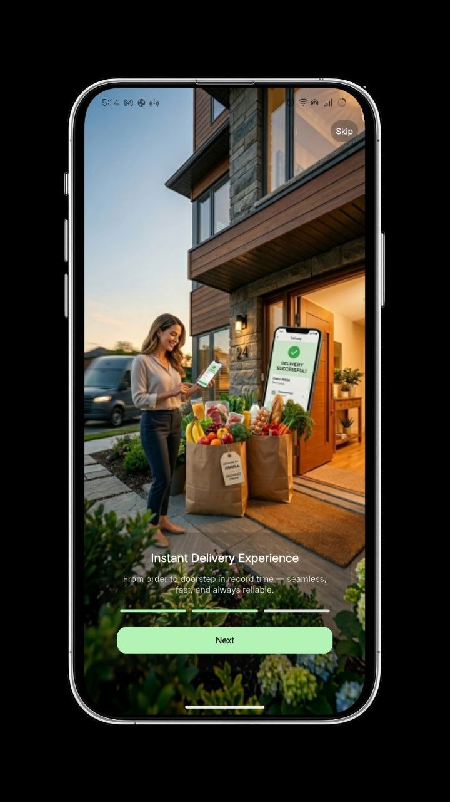 |  |

| Sign Up | Profile Image | Validation |
|:---:|:---:|:---:|
| 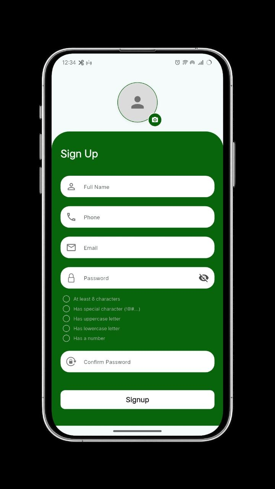 | 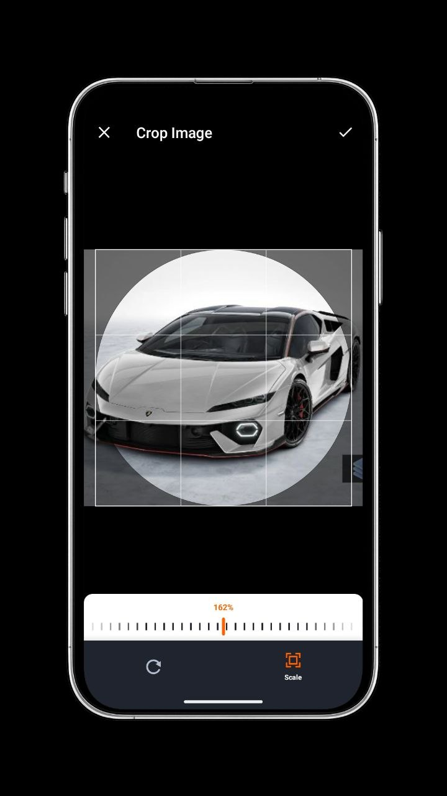 | 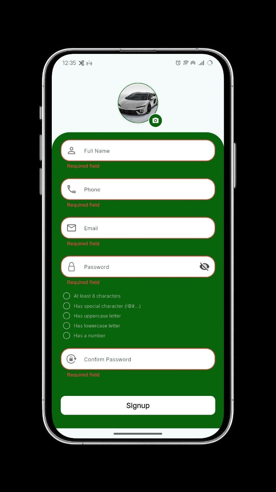 |

**Home & Search**

| Home | Search | Search Filter |
|:---:|:---:|:---:|
| 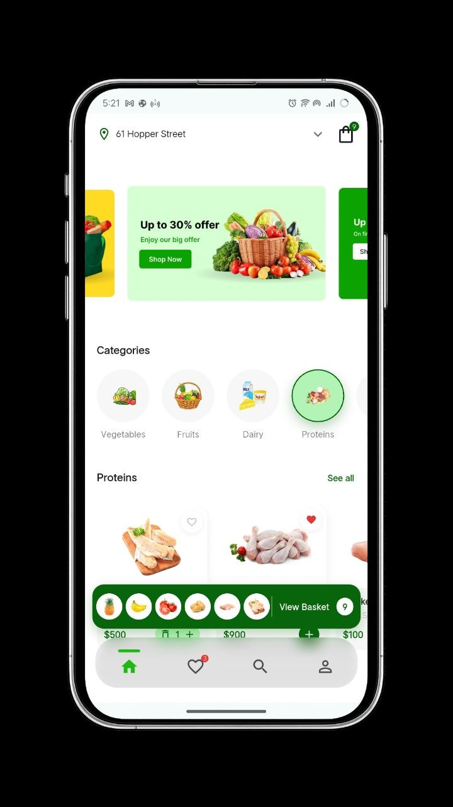 | 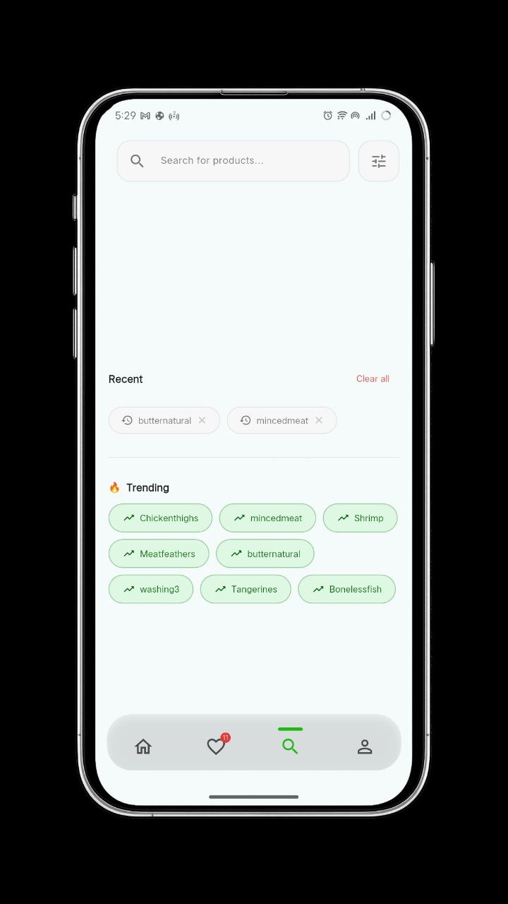 | 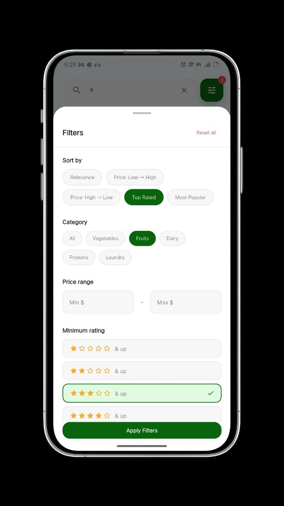 |

| Search Result | | |
|:---:|:---:|:---:|
| 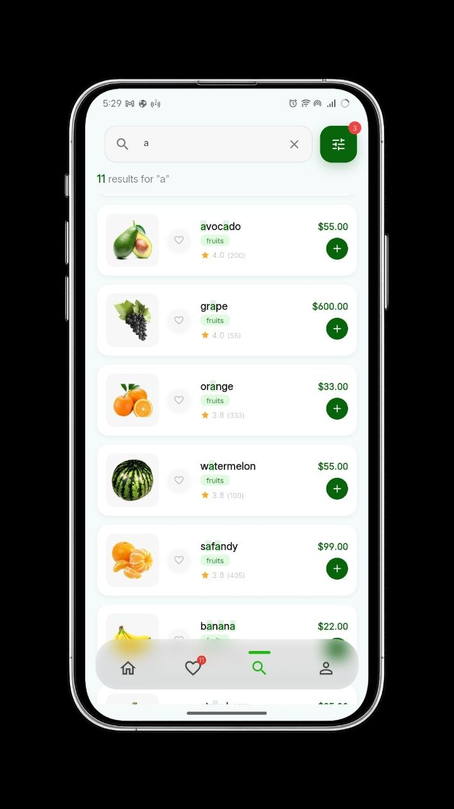 | | |

**Cart**

| Cart | Empty State | Delete Item |
|:---:|:---:|:---:|
| 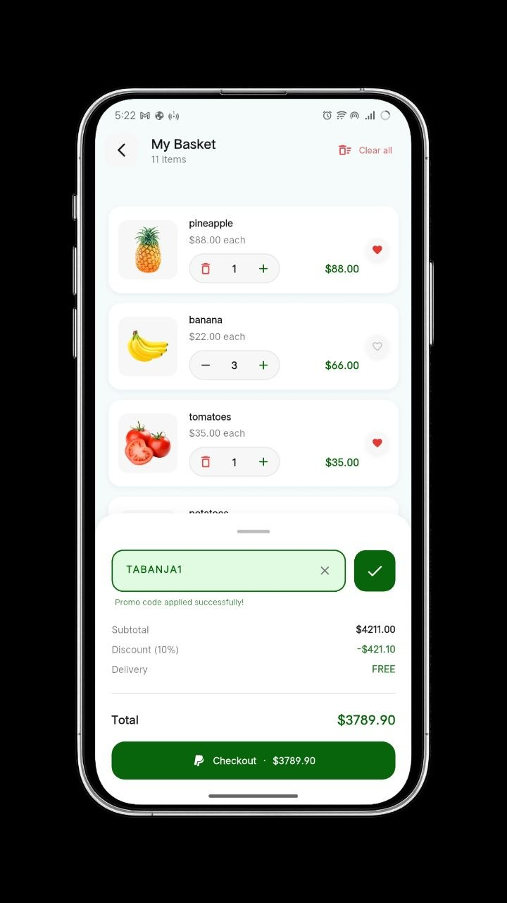 | 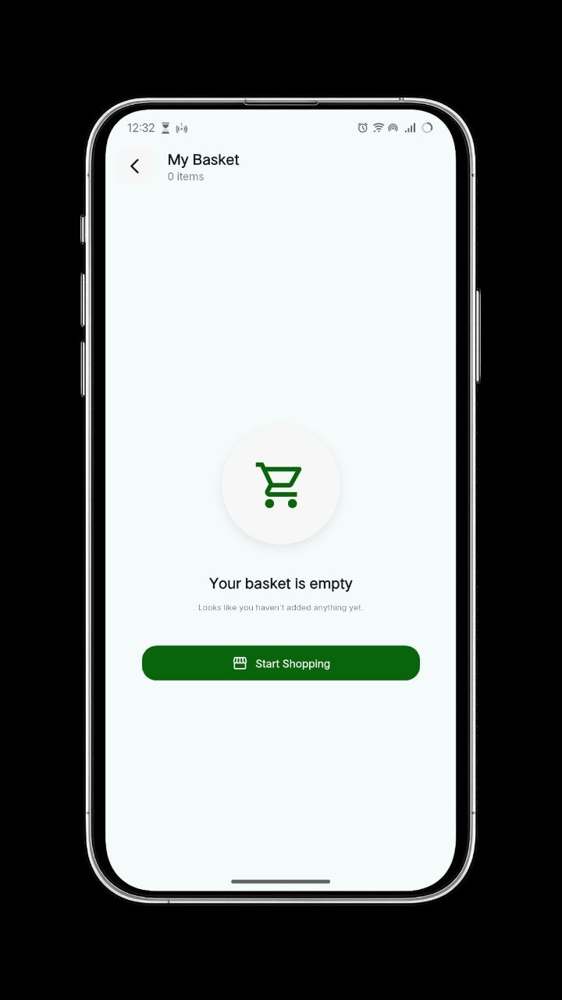 | 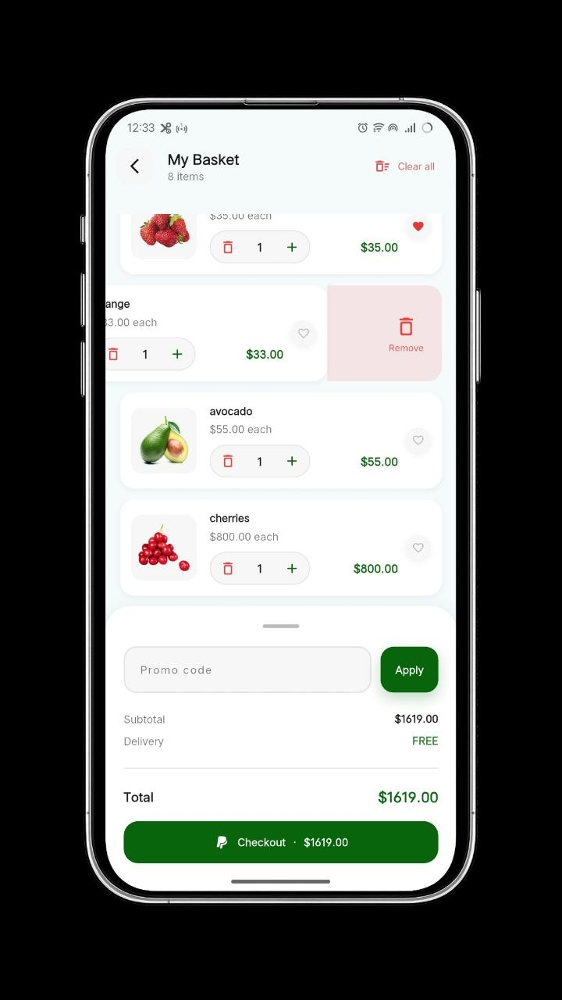 |

| Checkout | | |
|:---:|:---:|:---:|
| 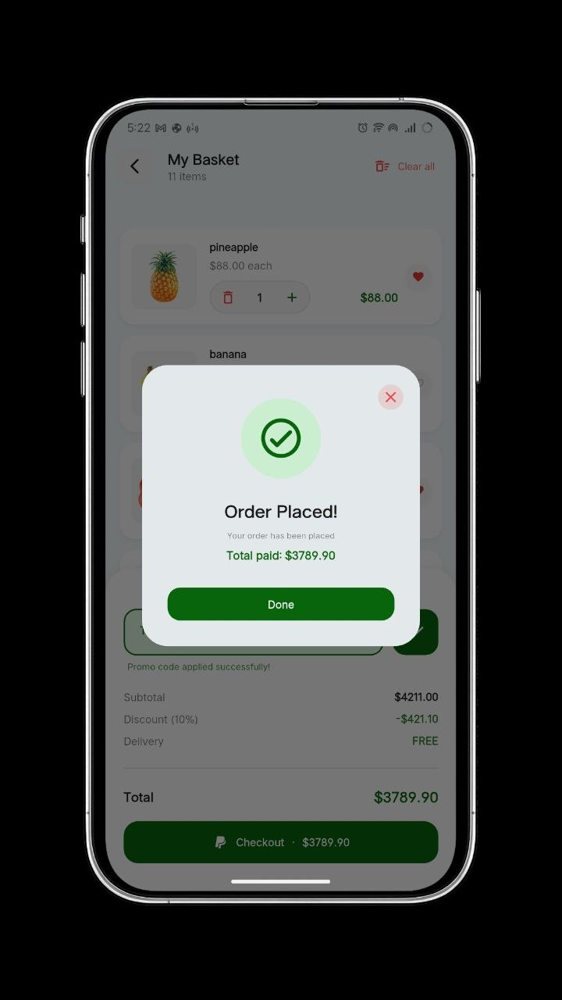 | | |

**Favorites & Profile**

| Favorites | Filter | Delete Item |
|:---:|:---:|:---:|
| 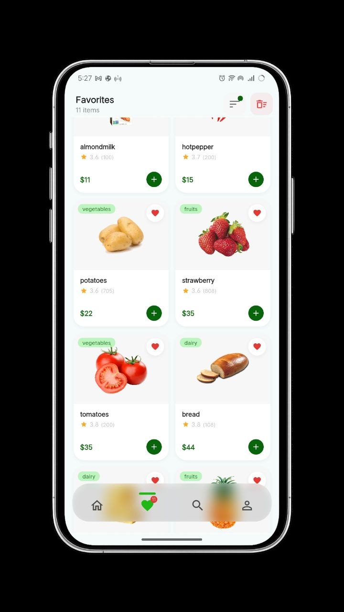 | 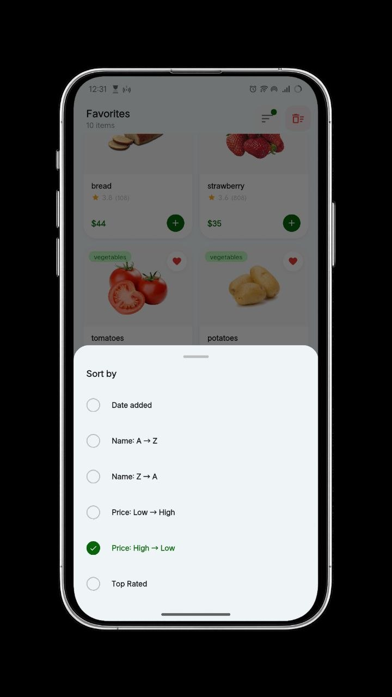 | 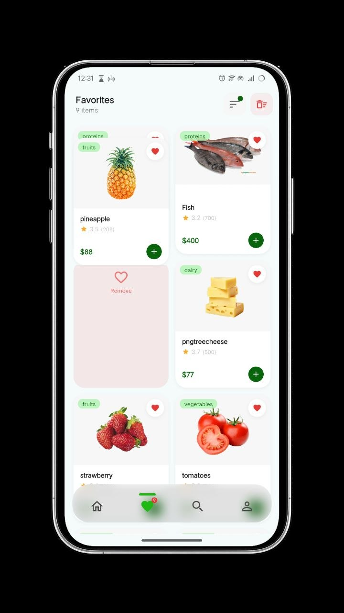 |

| Profile | | |
|:---:|:---:|:---:|
| 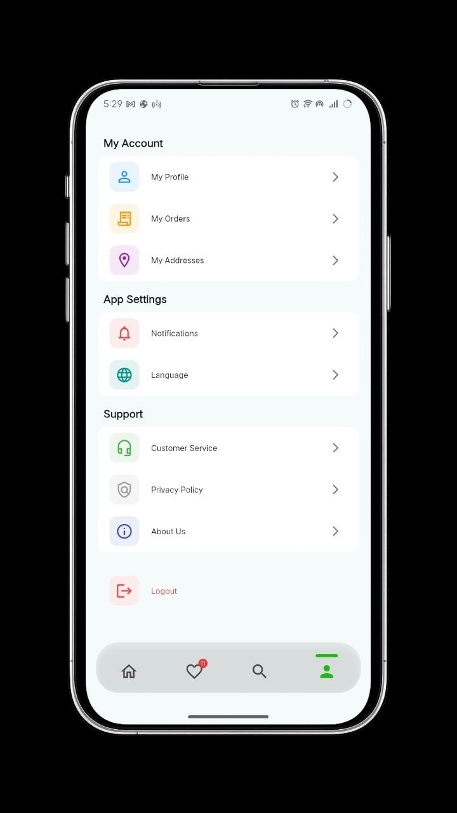 | | |

---

## ✨ Features

- 🚀 **Onboarding** — Smooth intro screens shown only on first launch
- 🔐 **Authentication** — Login & signup with profile image, real-time password strength indicator
- 🏠 **Home** — Auto-playing banner carousel, animated category filter, horizontal product grid, floating cart bar
- 🔍 **Search** — Debounced live search, filter by category / price / rating, sort options, query highlighting in results
- 🛒 **Cart** — Add/remove items, swipe-to-delete, promo codes, delivery fee logic, animated order summary
- ❤️ **Favorites** — Persistent wishlist, animated heart button with haptic feedback, sort & swipe-to-remove
- 👤 **Profile** — Account menu with orders, addresses, notifications, language, and logout

---

## 🏗️ Architecture

The project follows **Clean Architecture** with strict separation between layers across every feature.

```
lib/
├── main.dart
├── sooq_app.dart
├── root.dart                        # Bottom nav shell with IndexedStack
│
├── core/
│   ├── routing/
│   │   ├── app_router.dart          # GoRouter — all routes with fade transitions
│   │   └── routes.dart              # Route name constants
│   ├── supabase/
│   │   ├── supabase_auth_services.dart
│   │   ├── supabase_client.dart
│   │   ├── supabase_constants.dart
│   │   └── supabase_error.dart
│   ├── theme/
│   │   ├── app_colors.dart
│   │   └── app_text_styles.dart
│   └── utils/
│       ├── di/
│       │   └── get_it.dart          # Dependency injection setup
│       ├── ld/
│       │   └── pref_helper.dart     # SharedPreferences unified wrapper
│       ├── custom_button.dart
│       ├── custom_text.dart
│       ├── snack_bar.dart
│       ├── validators.dart
│       ├── responsive.dart
│       └── iterable_extension.dart
│
└── features/
    ├── On_Boarding/
    ├── Auth/
    ├── Home/
    ├── Search/
    ├── Cart/
    ├── Favorite/
    └── Profile/
```

Every feature follows the same internal pattern:

```
feature/
├── data/
│   ├── models/
│   └── repos/
│       ├── feature_repo.dart          # Abstract contract
│       └── feature_repo_impl.dart     # Supabase implementation
└── presentation/
    ├── cubit/
    │   ├── feature_cubit.dart
    │   └── feature_state.dart
    └── views/
        ├── feature_view.dart
        └── widgets/
```

---

## 🧠 State Management

State is managed exclusively with **flutter_bloc (Cubit)** — no `setState` for business logic anywhere in the codebase.

| Cubit | Scope | How it's provided |
|-------|-------|-------------------|
| `AuthCubit` | Screen-scoped | `BlocProvider` in router |
| `PickImageCubit` | Screen-scoped | `BlocProvider` in router |
| `CategoryCubit` | Root-scoped | `MultiBlocProvider` on Root route |
| `CartCubit` | Root-scoped | `MultiBlocProvider` on Root route |
| `FavoritesCubit` | Root-scoped | `MultiBlocProvider` on Root route |
| `SearchCubit` | Screen-scoped | `BlocProvider` in `SearchView` |

`CartCubit` and `FavoritesCubit` are provided at the `Root` route level — the favorites badge in the nav bar, the heart button on every product card, and the floating cart bar all share one live instance with zero synchronization needed.

---

## 🗺️ Navigation

Navigation uses **GoRouter** with a custom `FadeTransition` on every route.

| Route | Path | Description |
|-------|------|-------------|
| Onboarding | `/` | First launch intro |
| Login | `/Login` | Auth entry point |
| Signup | `/Signup` | Registration |
| Root | `/Root` | Main shell — bottom nav with 4 tabs |
| Cart | `/Cart` | Full cart screen |

---

## 🔧 Tech Stack

| Concern | Solution |
|---------|----------|
| Framework | Flutter |
| Language | Dart |
| Backend | Supabase (Auth + Database + Storage) |
| State Management | flutter_bloc (Cubit) |
| Dependency Injection | get_it |
| Navigation | go_router |
| Error Handling | dartz (`Either<SupabaseError, T>`) |
| Local Persistence | shared_preferences (via `PrefHelper`) |
| Image Picking & Cropping | image_picker + image_cropper |
| Image Caching | cached_network_image |
| Responsive Text | auto_size_text |

---

## 📦 Dependencies

```yaml
dependencies:
  flutter_bloc:
  get_it:
  dartz:
  go_router:
  supabase_flutter:
  shared_preferences:
  image_picker:
  image_cropper:
  cached_network_image:
  carousel_slider:
  gap:
  flutter_svg:
  auto_size_text:
  loading_animation_widget:
```

---

## 🚀 Getting Started

### Prerequisites

- Flutter SDK `>=3.0.0`
- Dart SDK `>=3.0.0`
- A [Supabase](https://supabase.com) project

### Installation

**1. Clone the repository**
```bash
git clone https://github.com/your-username/sooq.git
cd sooq
```

**2. Install dependencies**
```bash
flutter pub get
```

**3. Configure Supabase**

Open `lib/core/supabase/supabase_constants.dart` and replace the values:

```dart
class SupabaseConstants {
  static const String url     = 'YOUR_SUPABASE_URL';
  static const String anonKey = 'YOUR_SUPABASE_ANON_KEY';
}
```

> ⚠️ Add `supabase_constants.dart` to `.gitignore` before your first push to avoid exposing your credentials.

**4. Run the app**
```bash
flutter run
```

---

## 🎨 Design System

All colors and typography are centralized — no magic numbers or hardcoded values anywhere in the codebase.

**Typography** — `AppTextStyles` · Font: **Poppins**

| Token | Size | Weight | Use |
|-------|------|--------|-----|
| `displaySmall` | 22 | 700 | Hero headings |
| `titleLarge` | 18 | 700 | Screen titles |
| `titleMedium` | 16 | 600 | Section headers |
| `titleSmall` | 14 | 600 | Card titles |
| `bodyLarge` | 14 | 500 | Primary body text |
| `bodyMedium` | 13 | 400 | Secondary body text |
| `labelLarge` | 13 | 600 | Buttons, labels |
| `caption` | 11 | 400 | Metadata, hints |

**Colors** — `AppColors`

| Token | Hex | Use |
|-------|-----|-----|
| `primary` | `#08650B` | Brand green |
| `primaryLight` | `#B4F3B6` | Tinted surfaces |
| `surface` | `#F7F7F7` | Card backgrounds |
| `error` | `#EF4444` | Errors, destructive actions |
| `warning` | `#F9A825` | Warnings |

**Shadow tokens:** `shadowSm` · `shadowMd` · `shadowLg` · `shadowPrimary`

---

## 🔑 Key Design Decisions

**1. `PrefHelper` as a unified persistence layer**
All `SharedPreferences` access goes through a single static `PrefHelper` — recent searches and favorites both use it, with a lazy singleton pattern to avoid repeated `getInstance()` calls across the app.

**2. Either-based error handling**
All repository methods return `Either<SupabaseError, T>`. Supabase exceptions are caught and mapped to user-readable messages inside `AuthService` before they ever reach a cubit — the UI always receives a clean, typed result.

**3. Root-level cubit provision**
`CartCubit` and `FavoritesCubit` are provided at the `Root` route via `MultiBlocProvider`. Any screen rendered inside the bottom nav shell can access them without re-creation or prop-drilling.

**4. Fade transitions on all routes**
Every GoRouter `pageBuilder` uses `CustomTransitionPage` with a `FadeTransition` at 400ms — a consistent, polished feel across the entire navigation flow.

**5. Glassmorphic bottom navigation bar**
The nav bar in `root.dart` uses `BackdropFilter` with `ImageFilter.blur(sigmaX: 12, sigmaY: 12)` and a semi-transparent overlay to achieve a frosted glass effect that floats over the page content.

**6. Debounced search**
`SearchCubit` cancels and restarts a `Timer` on every keystroke with a 350ms delay — zero wasted computation while the user is typing, and instant results when they pause.

---

## 🤝 Contributing

1. Fork the project
2. Create your branch: `git checkout -b feature/your-feature`
3. Commit your changes: `git commit -m 'feat: add your feature'`
4. Push to the branch: `git push origin feature/your-feature`
5. Open a Pull Request

---

## 📄 License

This project is licensed under the MIT License — see the [LICENSE](LICENSE) file for details.

---

<div align="center">

Built with ❤️ using Flutter

</div>
